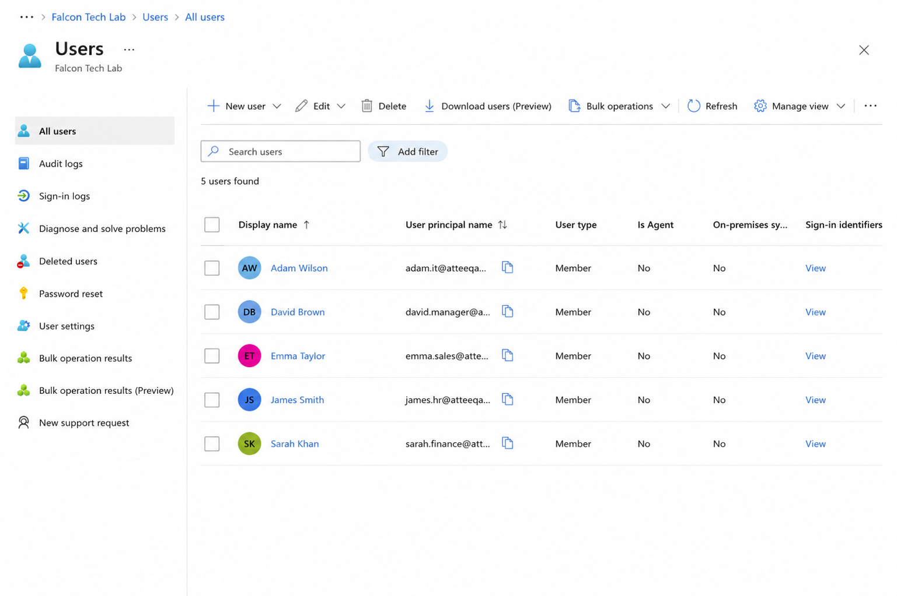
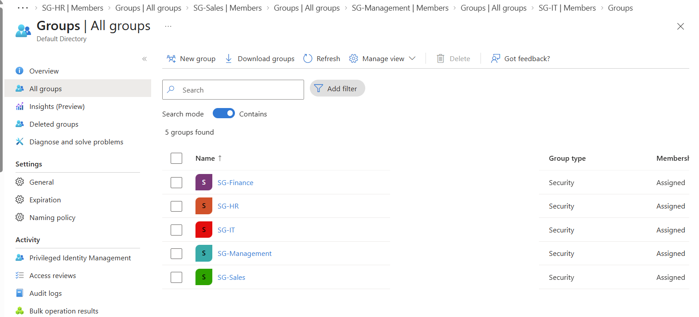
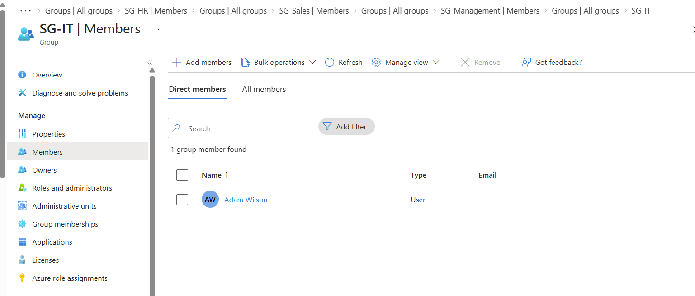
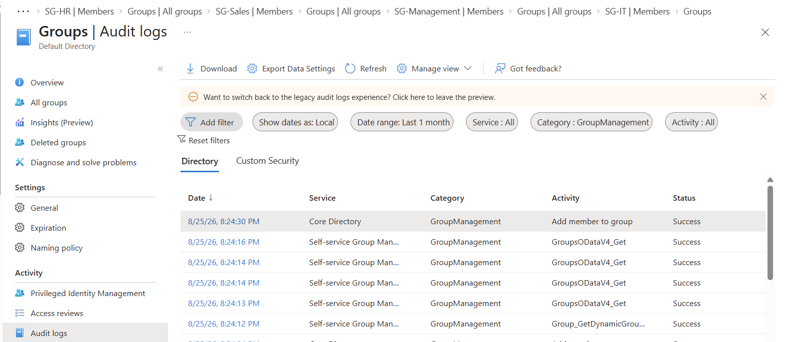

# Project 01 – Microsoft Entra ID User & Group Management

## Overview

This project demonstrates practical Identity and Access Management (IAM) administration using Microsoft Entra ID within a simulated enterprise environment named **Falcon Tech Lab**.

The objective was to build a basic identity structure, provision users, organise users using security groups, manage group membership, and verify administrative changes using Microsoft Entra audit logs.

---

## Technologies Used

- Microsoft Entra ID
- Microsoft Azure
- Microsoft Entra Admin Center
- Entra Audit Logs
- GitHub

---

## Lab Scenario

Falcon Tech requires an identity structure for employees across several business departments.

The following departments were created within the lab environment:

- IT
- Finance
- Human Resources
- Sales
- Management

Each employee was provisioned as a Microsoft Entra ID user and assigned to an appropriate departmental security group.

---

## User Provisioning

Five test employee identities were created in Microsoft Entra ID.

| User | Department | Role |
|---|---|---|
| Adam Wilson | IT | IT Support Engineer |
| Sarah Khan | Finance | Finance Analyst |
| James Smith | HR | HR Specialist |
| Emma Taylor | Sales | Sales Executive |
| David Brown | Management | Operations Manager |

User attributes including display name, department and job title were configured to simulate an enterprise identity environment.

### User Provisioning Evidence

---

## Security Group Management

Departmental security groups were created using the **Assigned** membership model.

The following groups were configured:

| Security Group | Purpose |
|---|---|
| SG-IT | IT department access |
| SG-Finance | Finance department access |
| SG-HR | Human Resources access |
| SG-Sales | Sales department access |
| SG-Management | Management access |

Using security groups allows access to resources to be managed through group membership rather than assigning permissions individually to users.

### Security Groups

---

## Group Membership Management

Each user was assigned to the security group corresponding to their department.

For example:

**Adam Wilson → SG-IT**

This demonstrates group-based identity administration and provides a foundation for implementing role-based and least-privilege access controls.

### Membership Verification

---

## Audit & Monitoring

Microsoft Entra audit logs were used to verify changes made within the directory.

The audit trail recorded successful **Add member to group** operations under the **GroupManagement** category.

This provides administrators and security teams with visibility into identity changes and allows investigation of:

- What action occurred
- When the change occurred
- Whether the operation succeeded
- Which identity or group was affected
- Which actor initiated the change

### Audit Log Evidence

---

## IAM Concepts Demonstrated

This project provided hands-on experience with:

- Identity provisioning
- User account management
- User attribute management
- Microsoft Entra security groups
- Assigned group membership
- Group-based access management
- Identity lifecycle concepts
- IAM auditing
- Administrative activity monitoring
- Microsoft Entra object relationships

---

## Security Considerations

In a production environment, access should generally be assigned through groups rather than directly to individual users.

This improves scalability and supports principles such as:

**Role-Based Access Control (RBAC)** and **Least Privilege**.

Administrative changes should also be monitored through audit logs to provide accountability and support security investigations.

---

## Outcome

Successfully implemented a basic enterprise IAM structure within Microsoft Entra ID consisting of:

- 5 employee identities
- 5 departmental security groups
- Department-based group membership
- Identity attribute configuration
- Audit verification of membership changes

  This environment will be used as the foundation for additional IAM, security and endpoint management projects.
- Audit verification of membership changes

This environment will be used as the foundation for additional IAM, security and endpoint management projects.
