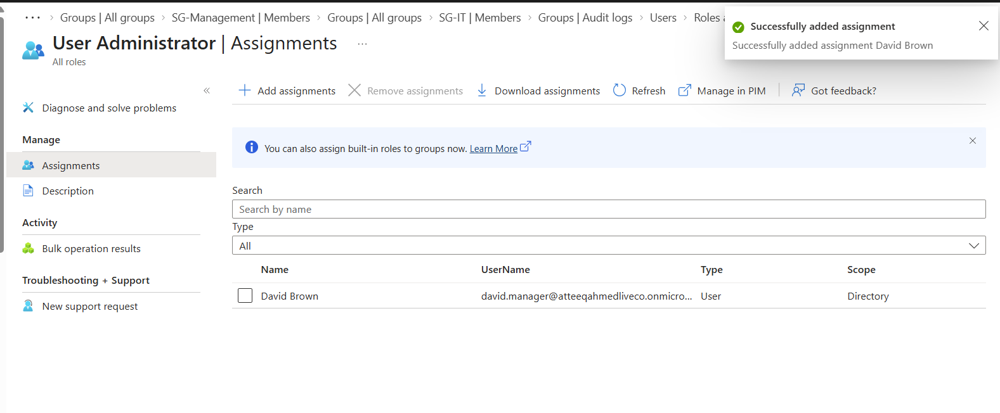
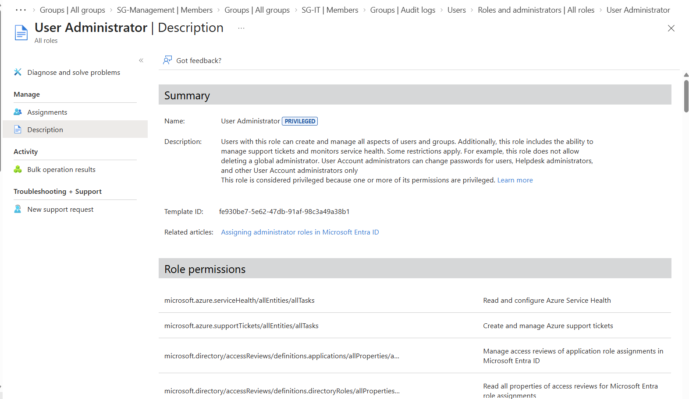
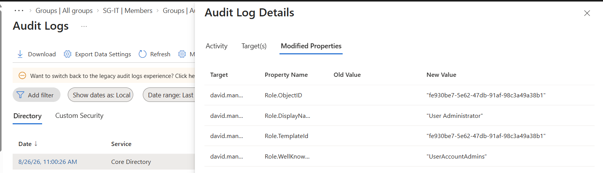
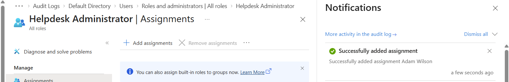
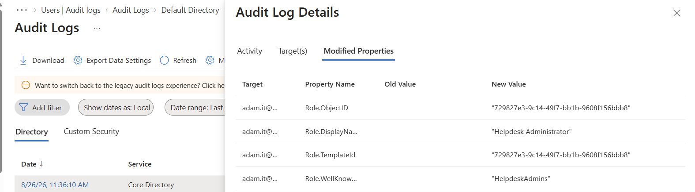

# Project 02 – Microsoft Entra ID RBAC & Least Privilege

## Overview

This project demonstrates practical Role-Based Access Control (RBAC) administration using Microsoft Entra ID within the simulated **Falcon Tech Lab** environment.

The objective was to implement the principle of least privilege by assigning specific Microsoft Entra administrative roles to users based on their job responsibilities rather than providing unnecessary Global Administrator access.

Administrative role assignments were then verified using Microsoft Entra audit logs.

---

## Technologies Used

- Microsoft Entra ID
- Microsoft Azure
- Microsoft Entra Admin Center
- Microsoft Entra Administrative Roles
- Role-Based Access Control (RBAC)
- Entra Audit Logs
- GitHub

---

## Lab Scenario

Falcon Tech requires administrative responsibilities to be separated between members of the IT team.

Rather than providing all IT administrators with Global Administrator access, individual roles were assigned based on operational responsibilities.

Two users were selected for delegated administrative access:

| User | Administrative Role | Responsibility |
|---|---|---|
| David Brown | User Administrator | User and group administration |
| Adam Wilson | Helpdesk Administrator | Password resets and first-line user support |

This approach follows the **principle of least privilege**, where users receive only the permissions required to perform their responsibilities.

---

## Task 1 – Assign the User Administrator Role

David Brown required permissions to perform user administration tasks.

I navigated to:

**Microsoft Entra ID → Roles and administrators → User Administrator → Assignments**

The **User Administrator** role was assigned to David Brown.

This role provides delegated permissions for managing users and groups, including user account administration and selected password-management capabilities.

### Evidence – User Administrator Assignment



The assignment confirms that David Brown has been successfully granted the User Administrator role.

---

## Task 2 – Review User Administrator Permissions

Before relying on the role assignment, I reviewed the permissions associated with the User Administrator role.

This helped verify what administrative capabilities were being delegated and ensured that a more privileged role such as Global Administrator was not required.

### Evidence – User Administrator Role Permissions



Reviewing role permissions is an important part of least-privilege administration because administrators should understand exactly what access is being granted.

---

## Task 3 – Verify the Role Assignment Using Audit Logs

After assigning the role, I used Microsoft Entra audit logs to verify that the administrative change had been recorded.

I navigated to:

**Microsoft Entra ID → Monitoring & health → Audit logs**

The audit logs were reviewed for **RoleManagement** activity.

An **Add member to role** event was identified.

The event showed:

- Activity: Add member to role
- Category: RoleManagement
- Status: Success
- Target user: David Brown

### Evidence – Role Assignment Audit Event



The audit event provides evidence that the administrative role assignment was successfully performed and recorded by Microsoft Entra ID.

I also reviewed the **Modified Properties** within the audit event.

The recorded role information identified:

**User Administrator**

This demonstrated how Entra audit logs can be used to investigate and verify privileged administrative changes.

---

## Task 4 – Assign the Helpdesk Administrator Role

A second administrative role was configured to demonstrate separation of responsibilities.

Adam Wilson was selected to perform first-line helpdesk administration.

I navigated to:

**Microsoft Entra ID → Roles and administrators → Helpdesk Administrator → Assignments**

The **Helpdesk Administrator** role was assigned to Adam Wilson.

### Evidence – Helpdesk Administrator Assignment



This role provides appropriate permissions for common helpdesk activities without granting broader administrative access.

---

## Task 5 – Verify the Helpdesk Administrator Assignment

The second role assignment was also verified using Microsoft Entra audit logs.

The relevant **RoleManagement** event was opened and its modified properties were reviewed.

The event identified the assigned role as:

**Helpdesk Administrator**

### Evidence – Helpdesk Administrator Audit Event



This confirmed that the role assignment was successfully recorded within Microsoft Entra ID.

---

## RBAC Design

The final administrative model implemented in the lab was:

```text
Falcon Tech Lab
│
├── David Brown
│   └── User Administrator
│
└── Adam Wilson
    └── Helpdesk Administrator
