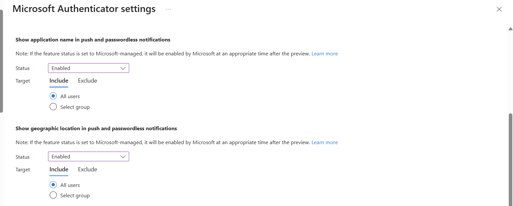
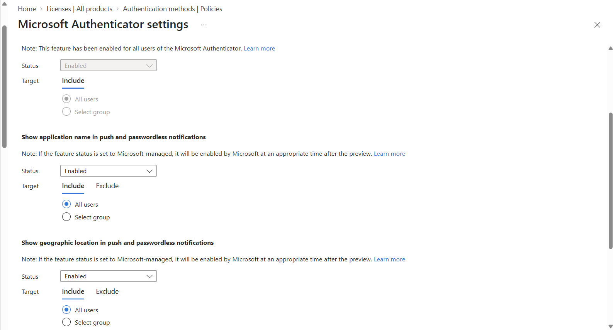
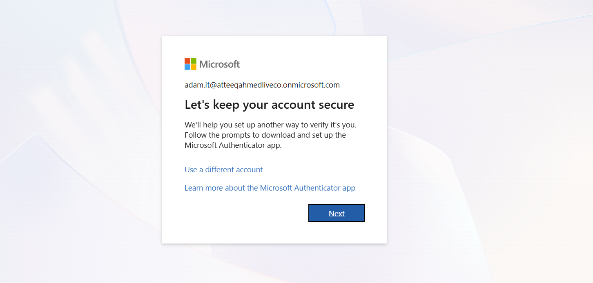
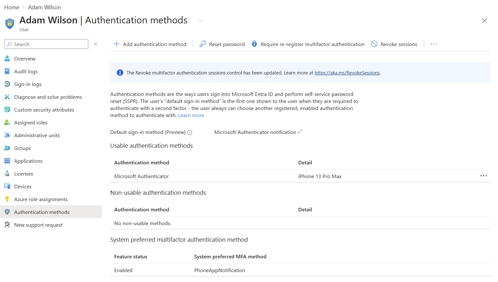

# Project 3 – Microsoft Entra ID MFA & Microsoft Authenticator

## Objective

Configure and test Multi-Factor Authentication (MFA) in Microsoft Entra ID using Microsoft Authenticator.

The purpose of this lab was to demonstrate how MFA strengthens identity security by requiring an additional authentication factor beyond a user's password.

---

## Lab Environment

- Microsoft Entra ID
- Microsoft Entra Admin Center
- Microsoft Authenticator
- Test User: Adam Wilson
- Security Defaults
- Microsoft Entra Sign-in Logs

---

## Tasks Completed

- Reviewed the Microsoft Authenticator authentication method policy
- Enabled enhanced Microsoft Authenticator security settings
- Enabled application name display in push notifications
- Enabled geographic location display in push notifications
- Required a test user to register Microsoft Authenticator
- Registered Microsoft Authenticator using a QR code
- Verified Microsoft Authenticator registration
- Configured Authenticator notifications as the user's default sign-in method
- Tested MFA authentication
- Reviewed authentication and sign-in activity in Microsoft Entra ID

---

## 1. Configure Microsoft Authenticator Security Settings

Microsoft Authenticator was configured through the Microsoft Entra authentication methods policy.

Additional security information was enabled for Authenticator push notifications, including application name and geographic location.

These features provide users with additional context when receiving authentication requests and can help reduce the risk of approving fraudulent MFA prompts.

---

## 2. Review Microsoft Authenticator Policy

The Microsoft Authenticator policy was reviewed to confirm that Authenticator was available to users.

Application name and geographic location information were enabled for Authenticator notifications.

This provides additional context to users when reviewing MFA requests.

---

## 3. User MFA Registration

A test account, **Adam Wilson**, was used to validate the MFA configuration.

When the user signed in, Microsoft Entra required additional security information to be configured.

The user was prompted to set up Microsoft Authenticator as an authentication method.

The Authenticator application was then configured by scanning the Microsoft Entra QR code and completing the registration process.

---

## 4. Verify Microsoft Authenticator Registration

After registration, the authentication methods assigned to the test user were reviewed in the Microsoft Entra Admin Center.

Microsoft Authenticator was successfully registered to the user's mobile device.

The configuration showed:

- Microsoft Authenticator registered
- Mobile device successfully associated with the account
- Authenticator notification configured as the default sign-in method
- System-preferred MFA enabled
- `PhoneAppNotification` selected as the preferred MFA method

---

## MFA Authentication Flow

The authentication process demonstrated in this lab was:

**Username + Password**

↓

**Microsoft Entra ID validates credentials**

↓

**MFA requirement triggered**

↓

**Microsoft Authenticator notification sent**

↓

**User approves authentication request**

↓

**Access granted**

This demonstrates how MFA provides an additional layer of protection if a user's password becomes compromised.

---

## Security Concepts Demonstrated

### Multi-Factor Authentication (MFA)

MFA requires users to provide more than one authentication factor before access is granted.

This reduces the risk associated with compromised passwords.

### Microsoft Authenticator

Microsoft Authenticator provides an additional authentication factor using a registered mobile device.

### Identity Protection

Requiring an additional authentication factor significantly improves account security compared with password-only authentication.

### MFA Prompt Context

Displaying application name and geographic location gives users additional information when evaluating an authentication request.

This can help users identify suspicious authentication attempts.

### System-Preferred MFA

Microsoft Entra can select the most secure authentication method registered by a user instead of relying solely on a user-selected default method.

---

## Skills Demonstrated

- Microsoft Entra ID administration
- Identity and Access Management (IAM)
- Multi-Factor Authentication (MFA)
- Microsoft Authenticator deployment
- Authentication method configuration
- MFA registration
- Authentication troubleshooting
- Sign-in monitoring
- Identity security
- Security Defaults
- User authentication management

---

## Real-World Application

In an enterprise environment, MFA is a critical identity security control.

An administrator may use Microsoft Entra ID to require MFA for users accessing corporate resources and configure authentication methods such as Microsoft Authenticator.

MFA can help protect organisations against threats including:

- Credential theft
- Password compromise
- Phishing
- Unauthorized account access
- Account takeover

Additional controls such as Conditional Access, Identity Protection and Privileged Identity Management can further strengthen the organisation's identity security posture.

---

## Outcome

Successfully configured and tested Microsoft Entra ID Multi-Factor Authentication using Microsoft Authenticator.

The lab demonstrated the end-to-end process of configuring Authenticator security settings, registering a user for MFA, verifying the registered authentication method and reviewing the resulting authentication configuration.

This project provided hands-on experience with Microsoft Entra ID identity security controls commonly used in enterprise IAM environments.
