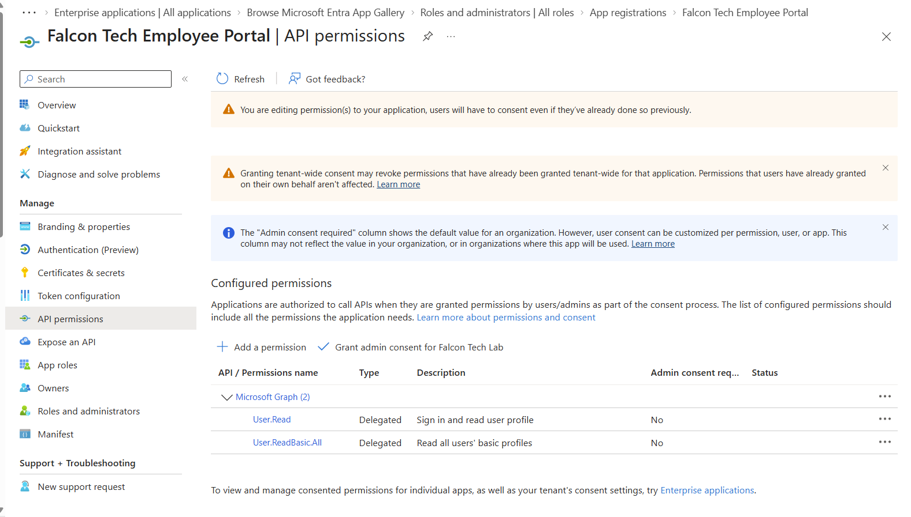
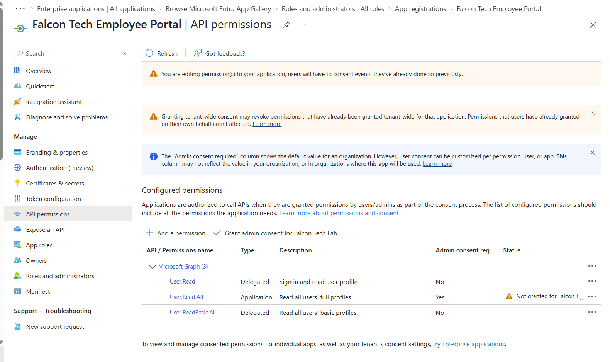
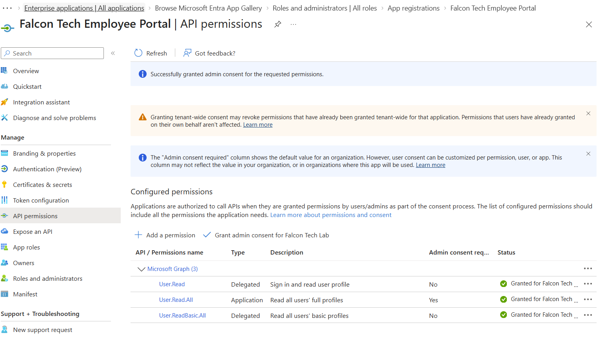
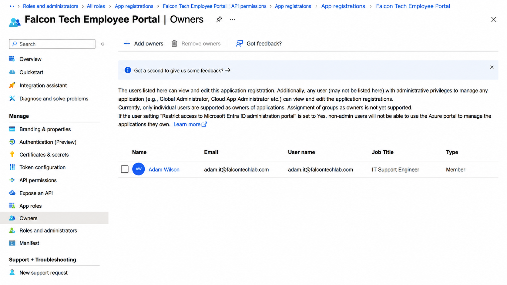
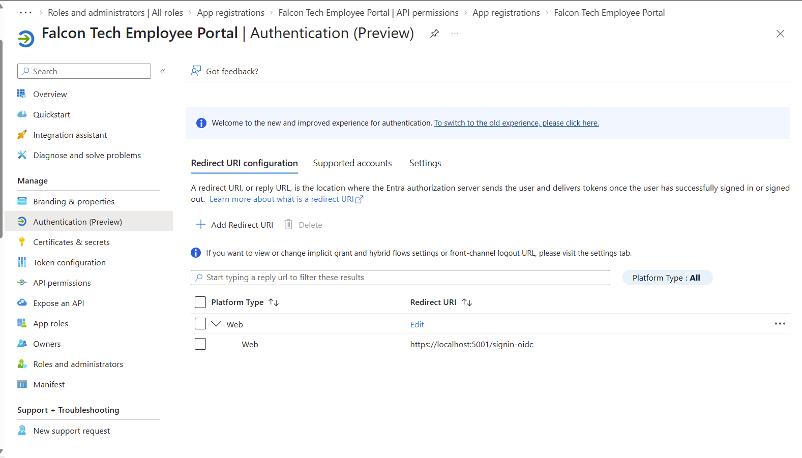
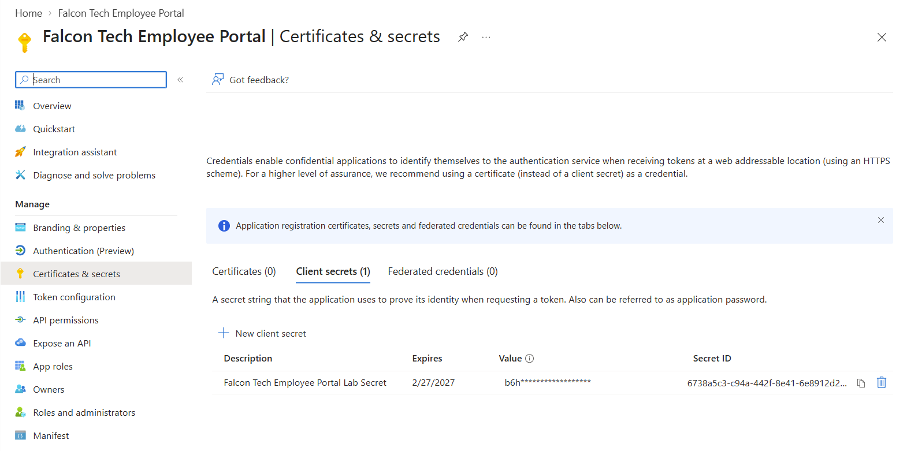
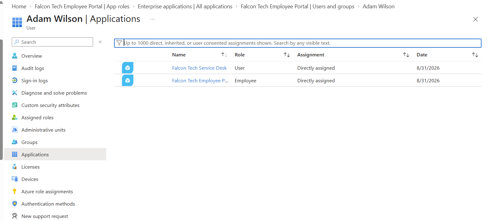
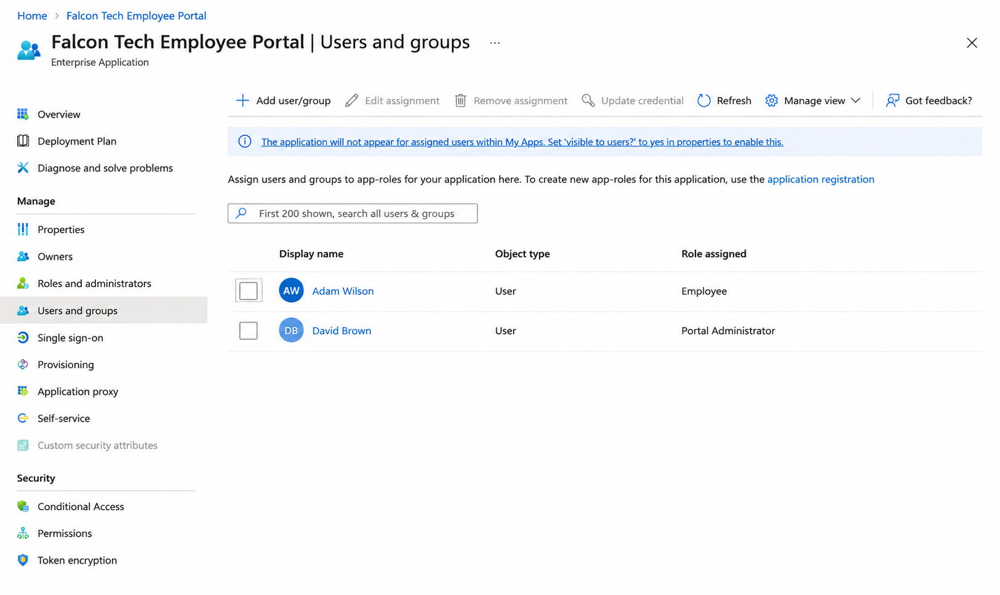
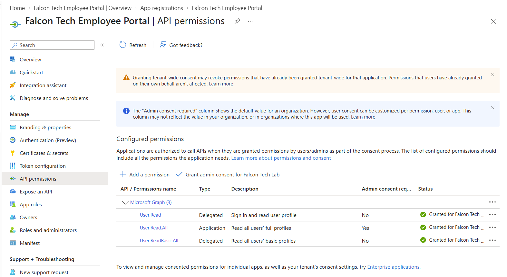
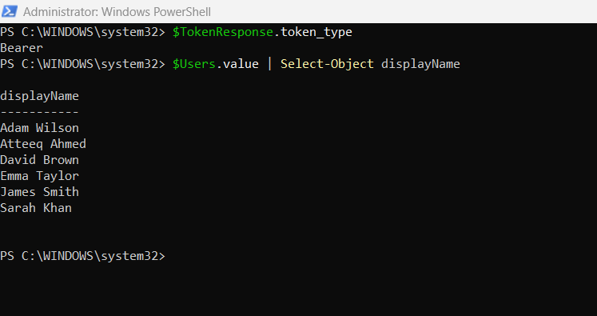

# Project 4 – Microsoft Entra ID Application Identity, OAuth 2.0 & Microsoft Graph

## Objective

Build and test an application identity in Microsoft Entra ID using App Registrations, application roles, Microsoft Graph API permissions, administrator consent, client credentials, and OAuth 2.0 app-only authentication.

The lab demonstrates how an application can authenticate using its own identity and securely access Microsoft Graph without requiring an interactive user sign-in.

---

## Lab Environment

- Microsoft Entra ID
- Microsoft Entra Admin Center
- App Registrations
- Enterprise Applications
- Microsoft Graph
- Microsoft Graph API Permissions
- PowerShell
- OAuth 2.0
- Client Credentials Flow
- Test Application: **Falcon Tech Employee Portal**
- Test users within the lab tenant

---

# Scenario

A fictional internal application called **Falcon Tech Employee Portal** was registered in Microsoft Entra ID.

The goal was to configure the identity and authorization components required for an enterprise application, including:

- Microsoft Graph permissions
- Administrator consent
- Application ownership
- Redirect URI configuration
- Client credentials
- Custom application roles
- User role assignments
- App-only OAuth authentication
- Microsoft Graph API access

---

# 1. Microsoft Graph Delegated Permissions

The application initially contained delegated Microsoft Graph permissions.

Delegated permissions are used when an application accesses Microsoft Graph **on behalf of a signed-in user**.

The configured delegated permissions included:

- `User.Read`
- `User.ReadBasic.All`



---

# 2. Microsoft Graph Application Permission

The lab was expanded to demonstrate **application-level access**.

The Microsoft Graph:

`User.Read.All`

**Application permission** was added.

Unlike delegated permissions, Application permissions allow the application to access Microsoft Graph using **its own identity**, without a signed-in user.

At this stage, administrator consent had not yet been granted.



---

# 3. Administrator Consent

Because `User.Read.All` is an Application permission capable of reading user profile information across the directory, administrator consent was required.

Administrator consent was granted for the Falcon Tech lab tenant.

This authorized the application to use the configured Microsoft Graph Application permission.



---

# 4. Application Ownership

An owner was assigned to the Falcon Tech Employee Portal App Registration.

Application owners can manage configuration relating to applications they own.

This demonstrates administrative ownership and accountability for application identities within Microsoft Entra ID.



---

# 5. Redirect URI Configuration

A web redirect URI was configured for the application:

`https://localhost:5001/signin-oidc`

Redirect URIs define where Microsoft Entra ID can return authentication responses during interactive authentication flows.

Although the final app-only Client Credentials test does not use the redirect URI, configuring one provided practical experience with standard web application registration.



---

# 6. Client Credential

A client secret was created for the Falcon Tech Employee Portal.

The credential allows the application to prove its identity to Microsoft Entra ID when requesting an OAuth access token.

Application authentication uses:

- Tenant ID
- Application (Client) ID
- Client credential

The **client secret value is not stored anywhere in this GitHub repository**.

During testing, a test credential that became exposed was revoked and replaced with a new credential.

This demonstrated practical **credential rotation and secret management**.



---

# 7. Application Roles

Custom application roles were configured for the Falcon Tech Employee Portal.

Two roles were created:

### Employee

Represents standard employee-level application access.

### Portal Administrator

Represents administrative-level application access.

A test identity was assigned the **Employee** role.



---

# 8. Role-Based Application Access

Different application roles were assigned to test identities:

- **Adam Wilson → Employee**
- **David Brown → Portal Administrator**



Microsoft Entra ID can issue assigned application roles as claims within authentication tokens.

The application itself must then inspect those role claims and enforce the appropriate authorization.

Therefore, creating an application role in Entra ID does not automatically create application functionality. It provides the identity and authorization information that the application can use when making access-control decisions.

---

# 9. Final Microsoft Graph Permissions

The final Microsoft Graph configuration contained both Delegated and Application permissions.

### Delegated

- `User.Read`
- `User.ReadBasic.All`

### Application

- `User.Read.All`

Administrator consent was granted for the required Application permission.



---

# 10. OAuth 2.0 Client Credentials Flow

The final stage was to prove that the Falcon Tech Employee Portal could authenticate using its **own application identity**.

PowerShell was used to request an OAuth 2.0 access token from Microsoft Entra ID.

The application supplied:

- Tenant ID
- Client ID
- Client secret
- Microsoft Graph `.default` scope
- `client_credentials` grant type

The token request used:

`https://graph.microsoft.com/.default`

This instructs Microsoft Entra ID to issue a token containing the Microsoft Graph Application permissions that have already been granted to the application.

Microsoft Entra ID successfully authenticated the application and returned:

`Bearer`

This confirmed that an OAuth access token had successfully been issued.

---

# Microsoft Graph API Test

The OAuth Bearer token was then used to authenticate a request to Microsoft Graph.

The application queried the Microsoft Graph users endpoint.

For the portfolio evidence, only the:

`displayName`

property was requested/displayed.

Microsoft Graph successfully returned the users from the test Microsoft Entra tenant.



This successfully demonstrated that:

1. Falcon Tech Employee Portal could authenticate using its own application identity.
2. OAuth 2.0 Client Credentials Flow was functioning.
3. Microsoft Entra ID successfully issued a Bearer access token.
4. The admin-consented `User.Read.All` Application permission was effective.
5. Microsoft Graph accepted the application's access token.
6. The application could read permitted directory data without an interactive user sign-in.

---

# Authentication Flow

```text
Falcon Tech Employee Portal
        |
        | Client ID + Client Credential
        v
Microsoft Entra ID
        |
        | OAuth 2.0 Client Credentials Flow
        v
OAuth Access Token
        |
        | Bearer Token
        v
Microsoft Graph
        |
        | User.Read.All
        v
Entra ID User Data
```

---

# Security Practices Demonstrated

- Application identity management
- Application ownership
- Role-based application authorization
- Delegated vs Application permissions
- Administrator consent
- OAuth 2.0 authentication
- Client Credentials Flow
- Client secret protection
- Credential rotation
- Access token protection
- Microsoft Graph authorization
- Least-privilege concepts

No client secrets or OAuth access tokens are stored in this repository.

---

# Skills Demonstrated

- Microsoft Entra ID
- Identity and Access Management (IAM)
- App Registrations
- Enterprise Applications
- Service Principals
- Application Roles
- Role-Based Access Control concepts
- Microsoft Graph
- Microsoft Graph API Permissions
- Delegated Permissions
- Application Permissions
- Administrator Consent
- OAuth 2.0
- Client Credentials Flow
- Bearer Tokens
- Client Secret Management
- Credential Rotation
- PowerShell
- Application Identity
- Workload Identity
- Least Privilege

---

# Key Takeaway

This project demonstrates an end-to-end Microsoft Entra ID application identity scenario.

I configured a dedicated App Registration with Microsoft Graph permissions, administrator consent, application ownership, a web redirect URI, client credentials, and custom application roles.

I then validated the configuration by authenticating the **Falcon Tech Employee Portal** using the **OAuth 2.0 Client Credentials Flow** and successfully querying Microsoft Graph using the admin-consented `User.Read.All` Application permission.

The lab provided practical experience with how applications authenticate to Microsoft Entra ID, how Microsoft Graph permissions are granted, how application roles can support authorization, and how workload identities can securely access Microsoft cloud resources without requiring an interactive user sign-in.
