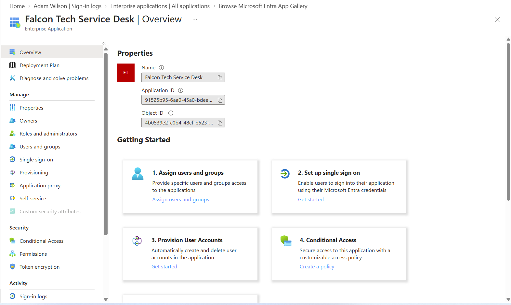
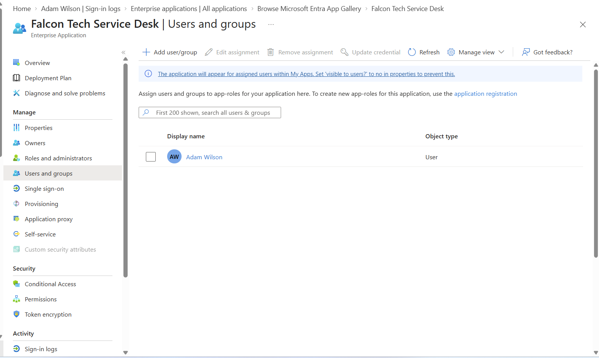
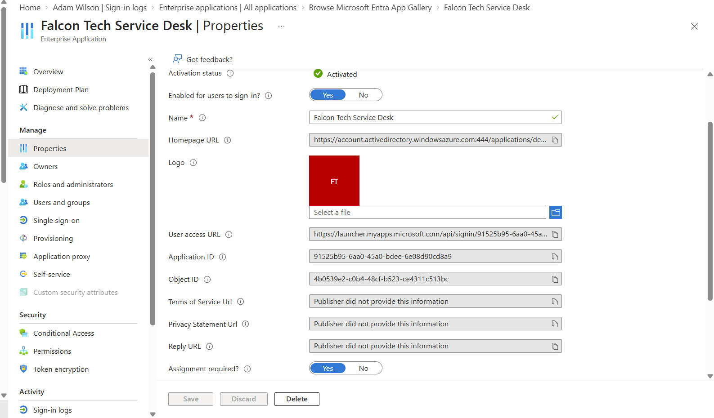
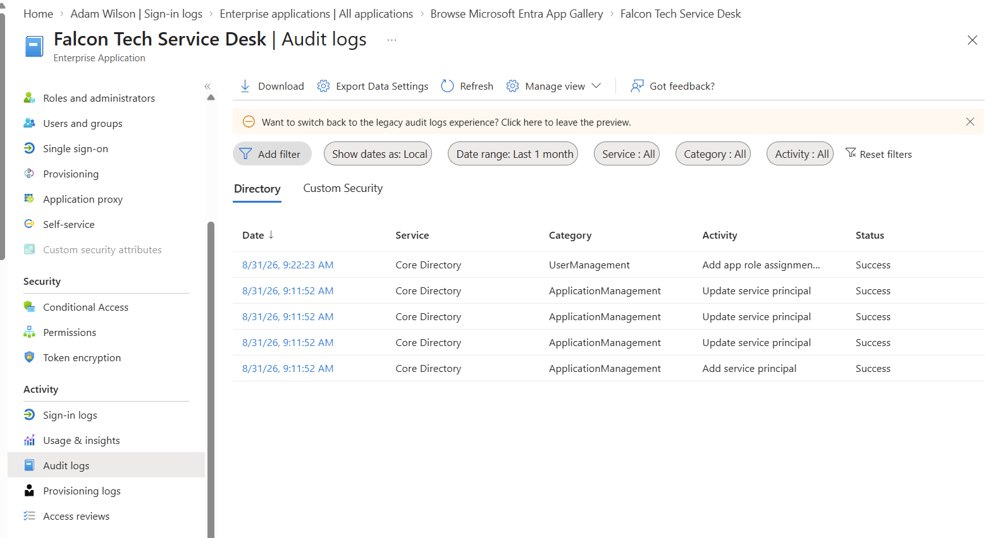

# Project 4 – Microsoft Entra ID Enterprise Application Access Management

## Objective

Create and configure an Enterprise Application in Microsoft Entra ID and implement controlled user access using application assignments.

The purpose of this lab was to demonstrate how Microsoft Entra ID can be used to manage access to enterprise applications, enforce assignment-based access, understand service principals, and audit application access changes.

---

## Lab Environment

- Microsoft Entra ID
- Microsoft Entra Admin Center
- Enterprise Applications
- Non-gallery Enterprise Application
- Test Application: Falcon Tech Service Desk
- Test User: Adam Wilson
- Microsoft Entra Audit Logs

---

## Scenario

Falcon Tech is introducing a new internal Service Desk application for IT support operations.

Rather than allowing unrestricted access, the application should be managed through Microsoft Entra ID so that only explicitly authorised users can access it.

The following requirements were implemented:

- Create the Falcon Tech Service Desk Enterprise Application
- Assign an authorised user to the application
- Require explicit user assignment for access
- Review application permissions
- Verify application configuration
- Review Microsoft Entra audit logs for application-related changes

---

## 1. Create the Enterprise Application

A new non-gallery Enterprise Application named **Falcon Tech Service Desk** was created in Microsoft Entra ID.

The Enterprise Application represents the application's service principal within the Falcon Tech Entra tenant.

The application overview provides administrative options for managing:

- Users and groups
- Single Sign-On (SSO)
- User provisioning
- Conditional Access
- Permissions
- Sign-in activity
- Audit activity

---

## 2. Assign User Access

The test user **Adam Wilson** was explicitly assigned access to the Falcon Tech Service Desk application.

Direct user assignment was used in this lab due to the licensing level of the lab tenant.

Application assignment allows administrators to control which identities are authorised to access a specific Enterprise Application.

---

## 3. Enforce Assignment-Based Access

The Enterprise Application properties were reviewed to verify the application's access configuration.

The following settings were confirmed:

- **Enabled for users to sign-in:** Yes
- **Assignment required:** Yes

With assignment required, users must be explicitly assigned to the Enterprise Application before they are permitted to access it.

This provides greater control over application access and supports the principle of least privilege.

---

## 4. Review Application Permissions

The application's permissions configuration was reviewed.

No admin-consented API permissions had been granted to the application.

No unnecessary permissions were added during the lab.

This demonstrates an important IAM principle: applications should only receive the permissions required for their intended purpose.

---

## 5. Review Enterprise Application Audit Logs

Microsoft Entra audit logs were reviewed to verify the administrative changes performed during the lab.

The audit trail recorded successful events including:

- Service principal creation
- Service principal updates
- Application role assignment

The user assignment was recorded as an application role assignment operation.

---

## Enterprise Application vs App Registration

An important concept demonstrated in this lab is the relationship between an application object and a service principal.

### App Registration

An App Registration defines an application's identity configuration within Microsoft Entra ID.

It can contain configuration such as:

- Application ID
- Authentication configuration
- Redirect URIs
- API permissions
- Credentials
- Application roles

### Enterprise Application

An Enterprise Application represents the application's **service principal** within a Microsoft Entra tenant.

The service principal is used to manage how the application interacts with identities in that tenant.

Administrators can use the Enterprise Application to manage:

- User and group assignments
- Single Sign-On
- Provisioning
- Permissions and consent
- Conditional Access
- Sign-in activity
- Audit activity

Understanding the relationship between App Registrations and Enterprise Applications is an important Microsoft Entra ID administration concept.

---

## Identity Access Flow

The access model implemented in this lab can be represented as:

**Microsoft Entra User**

↓

**Enterprise Application Assignment**

↓

**Falcon Tech Service Desk Service Principal**

↓

**Assignment Requirement Evaluated**

↓

**Authorised Application Access**

This demonstrates how application access can be controlled through identity assignments rather than providing unrestricted access to all users.

---

## RBAC vs Enterprise Application Assignment

This lab also demonstrates the difference between administrative role assignments and application access assignments.

### Microsoft Entra RBAC

An Entra role such as **Helpdesk Administrator** grants administrative permissions within Microsoft Entra ID.

### Enterprise Application Assignment

An Enterprise Application assignment grants an identity access to a specific application.

For example, Adam Wilson having the **Helpdesk Administrator** role does not automatically mean that he should have access to every Enterprise Application.

Application access should be granted separately according to business requirements.

This separation supports least privilege and separation of duties.

---

## Security Concepts Demonstrated

### Least Privilege

Users should only receive access to applications required to perform their job responsibilities.

### Explicit Application Assignment

Requiring application assignment prevents unauthorised users from accessing applications simply because they exist within the organisation's Entra environment.

### Service Principals

A service principal represents an application's identity within a Microsoft Entra tenant.

It allows administrators to control how the application interacts with users and organisational resources.

### Application Permissions and Consent

Application permissions determine what resources and APIs an application may access.

Permissions should be reviewed carefully and unnecessary consent should be avoided.

### Audit Logging

Microsoft Entra audit logs provide visibility into identity and application administration activities.

Audit records can help administrators investigate:

- Application creation
- Service principal changes
- User assignments
- Permission changes
- Other administrative activity

---

## Licensing Observation

During the lab, the tenant allowed individual users to be assigned to the Enterprise Application.

Group-based application assignment was unavailable under the current lab tenant licensing level.

This demonstrated how Microsoft Entra licensing can affect the identity and application management capabilities available to administrators.

---

## SC-300 Relevance

This project provides practical experience relevant to the **Microsoft Identity and Access Administrator (SC-300)** certification.

The lab demonstrates concepts including:

- Enterprise Application management
- Service principals
- User application assignments
- Application access control
- Least privilege
- Permissions and consent
- Microsoft Entra audit logs
- Identity-based application access
- Enterprise application administration

These concepts are important when managing authentication and access to applications using Microsoft Entra ID.

---

## Skills Demonstrated

- Microsoft Entra ID administration
- Identity and Access Management (IAM)
- Enterprise Application management
- Service principal management
- User application assignment
- Application access control
- Least privilege
- Permissions and consent review
- Microsoft Entra audit logging
- Identity security
- Application access governance

---

## Real-World Application

In an enterprise environment, organisations commonly integrate SaaS and internal applications with Microsoft Entra ID.

Identity administrators are responsible for ensuring that access to these applications is appropriately controlled.

Rather than allowing every employee to access every application, administrators can use Enterprise Application assignments to provide access only to authorised identities.

Combined with technologies such as Single Sign-On, Conditional Access, automated provisioning, Privileged Identity Management, and Identity Governance, Microsoft Entra ID can provide centralised control over application access.

---

## Outcome

Successfully created and configured the **Falcon Tech Service Desk** Enterprise Application in Microsoft Entra ID.

The lab demonstrated how to assign an authorised user to an Enterprise Application, verify assignment-required access, review application permissions, understand the role of the service principal, and investigate administrative activity through Microsoft Entra audit logs.

This project provided hands-on experience with enterprise application access management and Microsoft Entra ID concepts relevant to real-world Identity and Access Management environments.

---

## Portfolio Skills

**Microsoft Entra ID | IAM | Enterprise Applications | Service Principals | Application Access | Least Privilege | Permissions | Audit Logs | SC-300**
