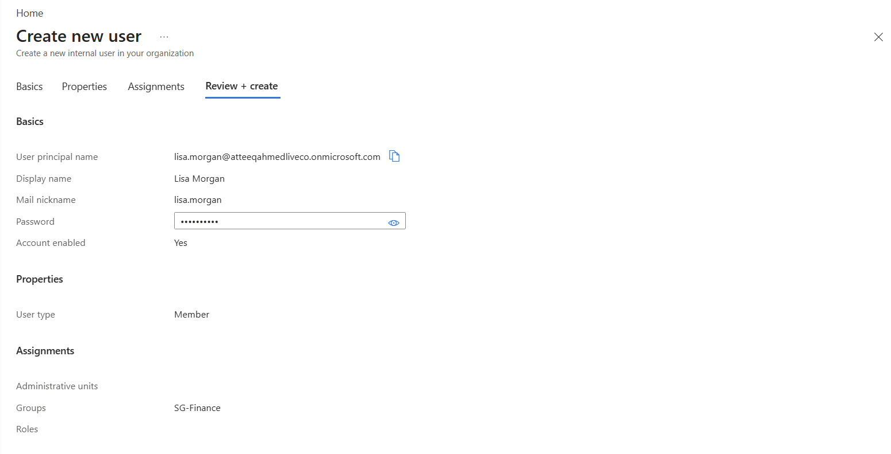
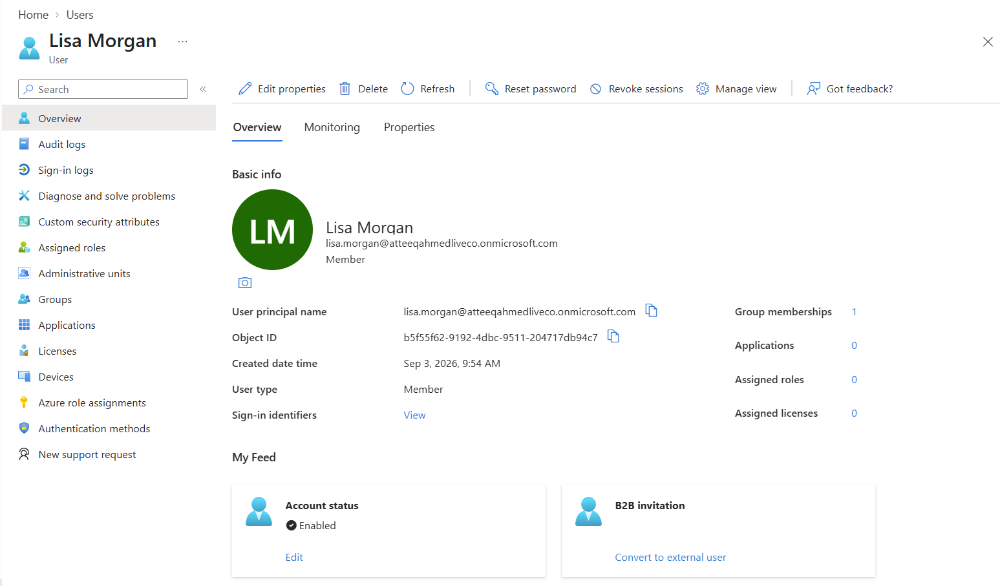
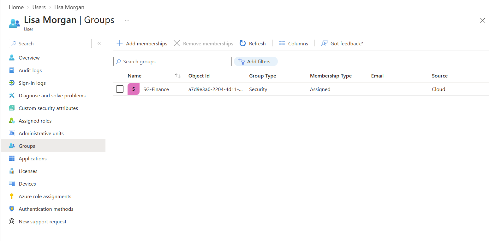
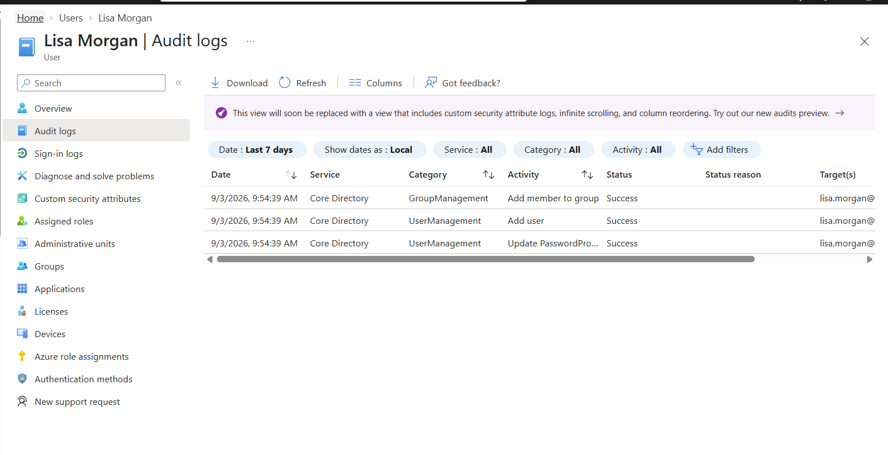
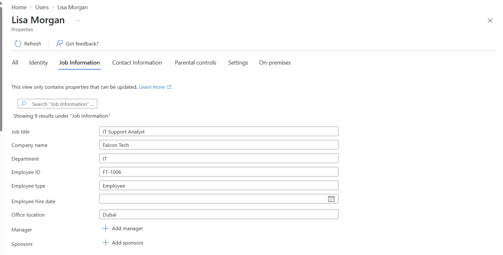
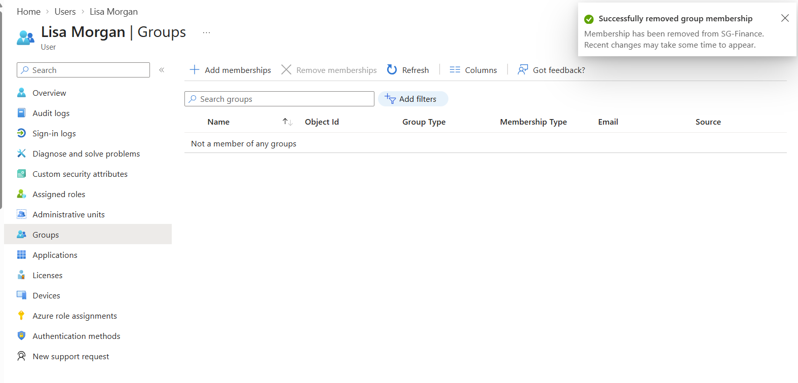
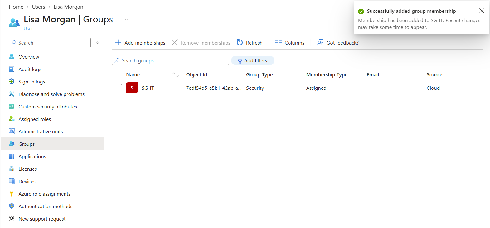
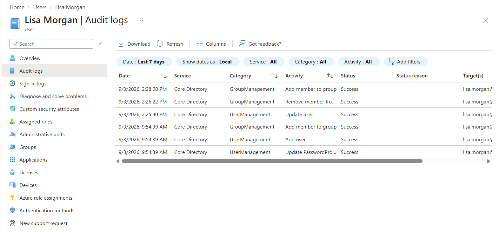
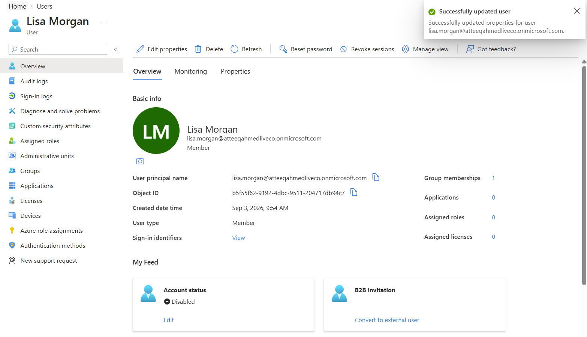
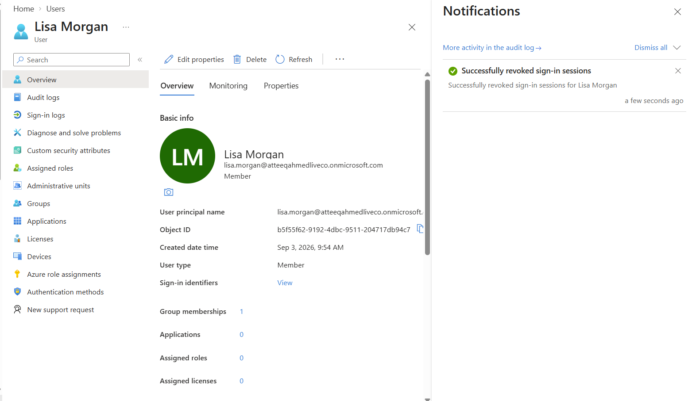

# Project 6 – Microsoft Entra ID Joiner, Mover & Leaver Identity Lifecycle

## 🎯 Objective

This lab demonstrates a practical **Joiner, Mover and Leaver (JML) identity lifecycle** using Microsoft Entra ID.

The objective was to simulate how an IT or IAM administrator manages a user's identity and access throughout their employment lifecycle:

- **Joiner** – provision a new user and provide appropriate access.
- **Mover** – update the user's role and adjust access when responsibilities change.
- **Leaver** – disable the account and revoke active sessions when the user leaves.

The lab also demonstrates the importance of **least privilege, access governance and audit logging** during identity lifecycle management.

---

## 🧪 Lab Scenario

A new employee joins the organisation and requires access to resources associated with their role.

During their employment, the employee moves from **Finance** into an **IT role**, requiring their access permissions to be changed.

Finally, the employee leaves the organisation and their identity must be securely disabled and active sessions revoked.

This simulates a common enterprise **Joiner → Mover → Leaver** workflow.

---

# 🟢 Phase 1 – Joiner

## 1. User Provisioning Review

Before creating the account, the new user's identity information and required attributes were reviewed.

This represents the initial provisioning stage where an administrator ensures the account is created with the correct organisational information.



---

## 2. User Account Created

The new employee account was successfully provisioned in **Microsoft Entra ID**.

Creating the identity establishes the user's account before access to organisational resources is assigned.



---

## 3. Finance Group Membership

The new employee was added to the appropriate **Finance security group**.

Using group-based access simplifies administration and allows permissions to be managed according to the employee's job function rather than individually.



---

## 4. Provisioning Audit Logs

Microsoft Entra ID **audit logs** were reviewed to verify the provisioning and access-management activities.

Audit logs provide evidence of administrative actions and are important for:

- Security investigations
- Compliance
- Change tracking
- Identity governance



---

# 🟡 Phase 2 – Mover

## 5. Job Information Updated

The employee changed roles within the organisation.

Their Entra ID profile was updated to reflect the new job information.

Identity attributes should remain aligned with the employee's current organisational responsibilities.



---

## 6. Finance Access Removed

Because the employee no longer required Finance access, their membership of the Finance security group was removed.

This demonstrates an important **least-privilege principle**:

> Access that is no longer required should be removed when a user's responsibilities change.



---

## 7. IT Access Added

The employee was then granted access appropriate to their new IT role.

This demonstrates how access can be adjusted as an identity moves between business functions.



---

## 8. Access Changes Verified Through Audit Logs

Entra ID audit logs were reviewed to confirm the changes made during the Mover process.

This provides an auditable record showing that access was removed and reassigned as part of the employee's role transition.



---

# 🔴 Phase 3 – Leaver

## 9. User Account Disabled

When the employee left the organisation, their Entra ID account was disabled.

Disabling the account prevents further authentication while retaining the identity for administrative, audit or retention purposes.



---

## 10. Active Sessions Revoked

Existing authentication sessions were revoked as part of the offboarding process.

This is an important security step because disabling an account alone may not immediately terminate every previously authenticated session.

Revoking sessions helps prevent continued access using existing authentication tokens.



---

# 🔄 Identity Lifecycle Flow

```text
Employee Joins
      |
      v
Create Entra ID Account
      |
      v
Assign Role-Based Group Access
      |
      v
Review Audit Logs
      |
      v
Employee Changes Role
      |
      v
Update Identity Attributes
      |
      v
Remove Previous Access
      |
      v
Assign New Access
      |
      v
Review Audit Logs
      |
      v
Employee Leaves
      |
      v
Disable Account
      |
      v
Revoke Active Sessions
```

---

## 🔐 Security Principles Demonstrated

This project demonstrates several important IAM security practices:

- Joiner, Mover and Leaver identity lifecycle management
- User provisioning and deprovisioning
- Role-aligned access management
- Security group membership management
- Least-privilege access
- Removal of obsolete permissions
- Account disabling
- Session revocation
- Administrative audit logging
- Identity governance principles

---

## 🛠 Skills Demonstrated

**Microsoft Entra ID**

- User administration
- Security group administration
- Identity lifecycle management
- Account provisioning
- Account deprovisioning
- Access modification
- Session revocation
- Audit log investigation

**Identity & Access Management**

- Joiner/Mover/Leaver processes
- Least privilege
- Role-based access concepts
- Access lifecycle management
- Identity governance
- Secure employee offboarding

---

## 💡 Key Takeaway

Identity security is not limited to creating user accounts.

Access must be continuously managed throughout the user's lifecycle.

A secure identity lifecycle ensures that:

**new employees receive the correct access, employees changing roles do not retain unnecessary permissions, and departing employees can no longer access organisational resources.**

This Joiner, Mover and Leaver process is a fundamental responsibility within enterprise **Identity and Access Management (IAM)**.
